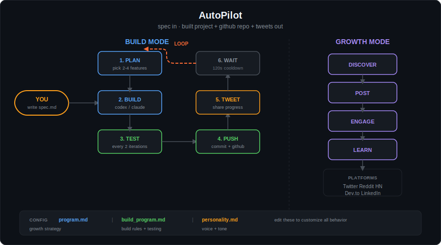

<p align="center">
  <h1 align="center">🚀 AutoPilot</h1>
  <p align="center">
    <strong>Give it a spec. Walk away. Come back to a built project on GitHub with tweets.</strong>
  </p>
  <p align="center">
    <a href="https://python.org"></a>
    <a href="LICENSE"></a>
    
    
    
  </p>
</p>

<br>

<p align="center">
  
</p>

<br>

AutoPilot is a single Python file that runs an **autonomous loop**: read your spec, plan features, write code, test it, push to GitHub, tweet about it, wait, repeat. It also has a growth mode that discovers communities and posts across platforms.

One file. Zero dependencies. Runs overnight.

---

## ⚡ 30-Second Demo

```bash
git clone https://github.com/ranausmanai/AutoPilot.git
cd AutoPilot

# write a spec (or use the included example)
echo "# A single HTML file showing current time. Dark background. Updates every second." > my_spec.md

# let it rip
python3 autopilot.py my_spec.md --build -e codex --iterations 1
```

What just happened:
1. Codex read your spec and built the code
2. AutoPilot created a GitHub repo for it
3. Code was committed and pushed
4. A tweet went out describing what was built

Now imagine running that with `--iterations 10` overnight.

---

## 🔨 Build Mode

The main event. Turns a markdown spec into a live project with continuous iteration.

```bash
# basic build
python3 autopilot.py spec.md --build -e codex

# with claude instead
python3 autopilot.py spec.md --build -e claude

# 5 iterations, medium reasoning
python3 autopilot.py spec.md --build -e codex --iterations 5 --reasoning medium
```

**Each iteration:**

| Step | What happens |
|------|-------------|
| 📋 **Plan** | LLM reads spec + existing code, picks 2-4 features |
| 🔨 **Build** | Codex/Claude writes the code (no timeout) |
| ✅ **Test** | Every 2 iterations: verify, find bugs, auto-fix |
| 📦 **Push** | Commit with descriptive message, push to GitHub |
| 🐦 **Tweet** | Compose and post an update about what changed |
| ⏳ **Wait** | 120s cooldown, then back to Plan |

The terminal shows live progress while the agent works:

```
  ⠋ Building... 45s │ 3 files │ 12.4 KB
    + index.html (2.1 KB)
    + style.css (856 B)
    ~ app.js (9.4 KB → 12.4 KB)
```

Green `+` for new files, yellow `~` for modified files with size diffs.

---

## 📣 Growth Mode

Autonomous marketing. Discovers where your audience hangs out and posts there.

```bash
# promote a project
python3 autopilot.py goal.md -e claude

# see what it would do first
python3 autopilot.py goal.md -e claude --dry-run

# limit to 3 rounds
python3 autopilot.py goal.md -e claude --rounds 3
```

**Platforms:** Twitter, Reddit, Hacker News, Dev.to, LinkedIn

**How it works:**
- Discovers relevant communities (subreddits, forums, etc.)
- Writes platform-appropriate content (no copy-paste across platforms)
- Tracks engagement and learns what works
- Respects cooldowns, never spams
- Strategy persists at `~/.autopilot/strategy/`

---

## 🎨 Customize Everything

All behavior lives in three markdown files. Edit them, change how AutoPilot thinks. No code changes needed.

```
📄 program.md          → growth strategy, platform rules, discovery tactics
📄 build_program.md    → feature planning, build process, testing, README style
📄 personality.md      → voice, tone, banned words, per-platform writing style
```

### Example: `personality.md`

```markdown
## Rules
- NO em dashes (—)
- NO words like: excited, thrilled, game-changer, revolutionary
- NO hashtags on any platform
- Write like a developer sharing work, not a marketer
```

This controls every tweet, Reddit post, and commit message AutoPilot generates.

---

## ⚙️ All Options

| Flag | What it does | Default |
|------|-------------|---------|
| `--build` | Build mode: develop + iterate + push + tweet | Off |
| `-e, --engine` | LLM backend: `claude` or `codex` | `claude` |
| `--iterations` | Max build iterations | `10` |
| `--rounds` | Max growth mode rounds | `5` |
| `--dry-run` | Show plan without executing | Off |
| `--reasoning` | Codex reasoning: `low` `medium` `high` `xhigh` | Codex default |

---

## 📂 What's in the Box

```
AutoPilot/
├── autopilot.py            # the engine (~1650 lines, zero deps)
├── program.md              # growth mode config
├── build_program.md        # build mode config
├── personality.md           # voice & tone config
├── assets/
│   └── flow.svg            # architecture diagram
└── examples/
    ├── example_goal.md     # sample: promote AutoShip
    ├── test_spec.md        # sample: build GitPulse terminal dashboard
    └── quick_test.md       # sample: minimal spec for pipeline testing
```

## 💾 Where Things Live at Runtime

| What | Path |
|------|------|
| Built projects | `~/.autopilot/builds/<project>/` |
| Action logs | `~/.autopilot/logs/` |
| Strategy memory | `~/.autopilot/strategy/` |
| Dry run output | `.dry-run.json` |

---

## 📋 Prerequisites

| Tool | Required | Why |
|------|----------|-----|
| Python 3.10+ | Yes | Runs the engine |
| [Claude CLI](https://docs.anthropic.com/en/docs/claude-code) or [Codex CLI](https://github.com/openai/codex) | Yes | LLM backend |
| [GitHub CLI](https://cli.github.com/) (`gh`) | For build mode | Creates repos, pushes code |
| [twitter-cli](https://github.com/sferik/t) | Optional | Posts tweets |

---

## 🧠 Tips

- **Test the pipeline first** with `examples/quick_test.md --iterations 1` before running real specs
- **`--dry-run`** in growth mode shows exactly what it would post, where, and why
- **Edit `personality.md`** before going live so the voice matches yours
- **`medium` reasoning** is fast and good enough for most builds. Use `xhigh` for complex projects
- **Check your builds** at `~/.autopilot/builds/` — open `index.html` or run the code locally

---

## 📄 License

[MIT](LICENSE) — do whatever you want with it.
